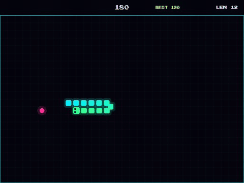
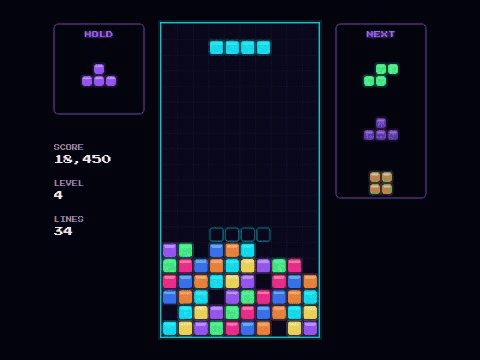
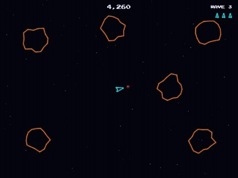
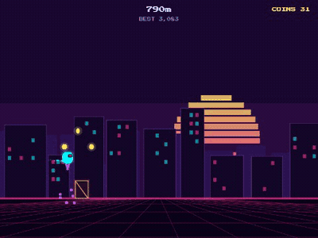

<div align="center">

<a href="https://tmhsdigital.github.io/GH-Arcade/">
  
</a>

<br />
<br />

[](https://tmhsdigital.github.io/GH-Arcade/)

[](https://github.com/TMHSDigital/GH-Arcade/actions/workflows/deploy.yml)
[](#games)
[](#features)
[](https://phaser.io)
[](https://www.typescriptlang.org)
[](https://vite.dev)
[](LICENSE)

**A growing collection of free, open-source arcade games that run in your browser.**<br />
No accounts. No ads. Keyboard, touch or gamepad. Install it and play offline.

[Games](#games) ·
[Features](#features) ·
[Quick start](#quick-start) ·
[Make a game](#make-your-own-game) ·
[How it works](#how-it-works) ·
[Roadmap](#roadmap)

</div>

<br />

<a id="games"></a>

## Games

### Neon Breakout

<p align="center">
  <a href="https://tmhsdigital.github.io/GH-Arcade/games/breakout/">
    
  </a>
</p>

The classic brick-breaker, rebuilt with a synthwave glow. Five hand-built levels that loop faster each time, armored bricks, a combo multiplier up to ×8 and four power-ups: wide paddle, multi-ball, slow-mo and extra life. **[Play Neon Breakout](https://tmhsdigital.github.io/GH-Arcade/games/breakout/)**

<table>
  <tr>
    <td width="50%" valign="top">
      <a href="https://tmhsdigital.github.io/GH-Arcade/games/snake/"></a>
      <h3><a href="https://tmhsdigital.github.io/GH-Arcade/games/snake/">Neon Snake</a></h3>
      <p>Eat, grow and speed up. Grab the timed bonus stars before they fade. Smooth gliding movement and a turn buffer, so quick double-turns always register.</p>
    </td>
    <td width="50%" valign="top">
      <a href="https://tmhsdigital.github.io/GH-Arcade/games/stack/"></a>
      <h3><a href="https://tmhsdigital.github.io/GH-Arcade/games/stack/">Neon Stack</a></h3>
      <p>The falling-block puzzler, done properly: wall kicks, a ghost piece, hold, a three-piece preview, lock delay, combos and back-to-back quads.</p>
    </td>
  </tr>
  <tr>
    <td width="50%" valign="top">
      <a href="https://tmhsdigital.github.io/GH-Arcade/games/astro/"></a>
      <h3><a href="https://tmhsdigital.github.io/GH-Arcade/games/astro/">Astro Blaster</a></h3>
      <p>Thrust, drift and blast through waves of splitting space rocks in glowing vector style. A saucer hunts you from wave 3, and hyperspace gets you out of a jam.</p>
    </td>
    <td width="50%" valign="top">
      <a href="https://tmhsdigital.github.io/GH-Arcade/games/runner/"></a>
      <h3><a href="https://tmhsdigital.github.io/GH-Arcade/games/runner/">Neon Runner</a></h3>
      <p>Sprint through a synthwave city. Jump, double jump, slide and dive past barriers, drones and pits while the pace keeps climbing.</p>
    </td>
  </tr>
</table>

<details>
<summary><b>Controls for every game</b></summary>

<br />

Every game also supports <kbd>P</kbd> / <kbd>Esc</kbd> / <kbd>Start</kbd> to pause, <kbd>M</kbd> / <kbd>Back</kbd> to mute, and pauses by itself when you switch tabs.

| Game | Keyboard | Gamepad | Touch |
| --- | --- | --- | --- |
| **Breakout** | <kbd>←</kbd> <kbd>→</kbd> move, <kbd>Space</kbd> launch (or use the mouse) | Stick or d-pad move, <kbd>A</kbd> launch | Drag to move, tap to launch |
| **Snake** | Arrows or <kbd>W</kbd> <kbd>A</kbd> <kbd>S</kbd> <kbd>D</kbd> steer | D-pad or stick steer | Swipe to steer |
| **Stack** | <kbd>←</kbd> <kbd>→</kbd> move, <kbd>↓</kbd> soft drop, <kbd>↑</kbd> / <kbd>X</kbd> rotate, <kbd>Z</kbd> rotate back, <kbd>Space</kbd> hard drop, <kbd>C</kbd> / <kbd>Shift</kbd> hold | D-pad move, <kbd>A</kbd> / <kbd>B</kbd> rotate, d-pad up hard drop, <kbd>Y</kbd> hold | Drag to move and soft drop, tap to rotate, flick up to hard drop, HOLD button |
| **Astro Blaster** | <kbd>←</kbd> <kbd>→</kbd> turn, <kbd>↑</kbd> thrust, <kbd>Space</kbd> / <kbd>Z</kbd> fire, <kbd>Shift</kbd> / <kbd>X</kbd> warp | Stick turn and thrust, <kbd>A</kbd> fire, <kbd>B</kbd> warp | On-screen stick, FIRE and WARP buttons |
| **Runner** | <kbd>Space</kbd> / <kbd>↑</kbd> jump (again in the air to double jump), <kbd>↓</kbd> slide or dive | <kbd>A</kbd> jump, <kbd>B</kbd> or stick down slide | Tap to jump, swipe down to slide or dive |

</details>

<details>
<summary><b>Scoring and power-ups</b></summary>

<br />

| Game | How you score |
| --- | --- |
| **Breakout** | Each brick is worth `10 × its hit points × combo`. The combo counts bricks broken since the ball last touched the paddle (max ×8). Clearing a level adds `250 × level`. |
| **Snake** | Food is worth 10, multiplied by 1 more for every 10 eaten. Every 5th food spawns a bonus star worth 50 plus 10 for each second left on its timer. |
| **Stack** | 1, 2, 3 or 4 lines score 100, 300, 500 or 800 × level. Back-to-back quads score ×1.5, combos add `50 × combo × level`, and drops add 1 point per row (2 for hard drops). Level up every 10 lines. |
| **Astro Blaster** | Large rocks 20, medium 50, small 100, saucer 500. Extra life every 10,000 points. |
| **Runner** | 1 point per metre plus 25 per coin. |

**Breakout power-ups:** green **W** widens the paddle for 12 seconds, purple **M** splits the ball into three, yellow **S** slows the ball to 70% for 8 seconds, and the rare pink **+** is an extra life.

</details>

<a id="features"></a>

## Features

<p align="center">
  
  <br />
  <sub>The hub: every game gets a cabinet card, filterable by tag, with your best score on it once you've played.</sub>
</p>

| Feature | Details |
| --- | --- |
| **Plays anywhere** | A static site on GitHub Pages. Loads straight in the browser on desktop, tablet or phone. |
| **Installable, works offline** | Install GH Arcade as an app from the hub. After one visit, every game plays with no connection. |
| **Keyboard, touch or gamepad** | Every game supports all three. Plug in a controller and it just works, including pause on <kbd>Start</kbd>. |
| **High scores** | Best scores are saved on your device and shown on the hub. No sign-up. |
| **Zero-asset audio** | Sound effects are synthesized live with the Web Audio API, so there are no audio files to download. |
| **Fast loads** | Each game is its own page and bundle. Phaser is split into one shared file that your browser caches across games. |
| **One command per game** | `npm run new-game` scaffolds a working game and adds it to the hub. No config to edit. |

<a id="quick-start"></a>

## Quick start

Requires **Node 20+**.

```bash
git clone https://github.com/TMHSDigital/GH-Arcade.git
cd GH-Arcade
npm install
npm run dev
```

Then open **http://localhost:5173/GH-Arcade/**.

| Script | What it does |
| --- | --- |
| `npm run dev` | Dev server with hot reload |
| `npm run build` | Type-check, then production build into `dist/` (including the service worker) |
| `npm run preview` | Serve the production build locally, to test offline mode and installing |
| `npm run typecheck` | TypeScript check only |
| `npm run new-game <slug> ["Title"]` | Scaffold a new game |

> [!TIP]
> In dev mode the running Phaser game is exposed as `window.game`, so you can inspect scenes from the browser console, for example `game.scene.getScene('Game')`. This is removed from production builds.

<a id="make-your-own-game"></a>

## Make your own game

Adding a game takes three steps, and no config files.

### 1. Scaffold it

```bash
npm run new-game space-dodge "Space Dodge"
```

This copies `games/_template/` to `games/space-dodge/`. The template is a small, playable Phaser game with keyboard, touch and gamepad controls, pause and high scores already wired up. The command also adds a card for it to the hub.

### 2. Describe it

Edit the new entry in [`games/registry.json`](games/registry.json). This is what the hub card shows.

```jsonc
{
  "slug": "space-dodge",              // folder name and URL: /games/space-dodge/
  "title": "Space Dodge",             // card title
  "description": "Weave through…",    // card blurb
  "tags": ["arcade", "shooter"],      // hub filter chips
  "accent": "#a45bff",                // card glow color
  "controls": "Arrows / touch",       // controls hint on the card
  "thumbnail": "thumbs/space-dodge.jpg" // optional 16:9 screenshot in public/; without it the card shows a big letter
}
```

### 3. Build it

Run `npm run dev`, open `/GH-Arcade/games/space-dodge/` and start editing `main.ts`. Vite picks up every `games/*/index.html` automatically, and the service worker precaches it for offline play. Push to `main` and it's live.

### The shared toolkit

Games import ready-made building blocks from [`shared/`](shared), so a new game gets menus, controls, pause and high scores for free:

```ts
import { ArcadeControls } from '../../shared/controls';
import { PauseController } from '../../shared/pause';
import { startArcadeGame } from '../../shared/phaser-config';
import { ArcadeGameOverScene } from '../../shared/scenes';

class GameScene extends Phaser.Scene {
  create() {
    this.controls = new ArcadeControls(this);                // keyboard + gamepad + touch in one API
    this.pause = new PauseController(this, this.controls);   // P / Esc / Start, mute, auto-pause
  }
  update() {
    if (this.pause.isPaused) return;
    this.player.x += this.controls.axisX * 5;                // analog stick or arrow keys
    if (this.controls.justPressed('action')) this.jump();    // Space, Enter or gamepad A
  }
}

startArcadeGame({ scenes: [MenuScene, GameScene, ArcadeGameOverScene] });
```

| Module | What it provides |
| --- | --- |
| [`controls.ts`](shared/controls.ts) | `ArcadeControls`: keyboard, gamepad and on-screen touch input behind `isDown()`, `justPressed()` and `axisX`/`axisY`, with extra per-game bindings. |
| [`pause.ts`](shared/pause.ts) | `PauseController`: pause and mute keys, a tap-to-resume overlay, and auto-pause when the tab loses focus. |
| [`touch.ts`](shared/touch.ts) | `onSwipe()` gestures, plus `VirtualStick` and `VirtualButton` that appear only on touch screens. |
| [`scenes.ts`](shared/scenes.ts) | `buildMenu()` title screens and the shared `ArcadeGameOverScene` with high-score checks. |
| [`ui.ts`](shared/ui.ts) | Neon text, banners, score popups, particle bursts and the shared color palette. |
| [`phaser-config.ts`](shared/phaser-config.ts) | `startArcadeGame()`: fit-to-screen Phaser setup with gamepads enabled, once the pixel font has loaded. |
| [`storage.ts`](shared/storage.ts) | `getHighScore()` and `submitHighScore()`, backed by `localStorage` that never throws. |
| [`sfx.ts`](shared/sfx.ts) | `tone()` and `noise()`: retro sound effects synthesized with Web Audio. |
| [`pwa.ts`](shared/pwa.ts) | Registers the service worker that makes every page work offline. |

> [!NOTE]
> Phaser is the default engine, but it's optional. A game is just an `index.html` with a script, so plain Canvas, Three.js or anything else Vite can bundle will work.

<a id="how-it-works"></a>

## How it works

Every push to `main` publishes the site automatically:

1. **Push** to `main` triggers the [deploy workflow](.github/workflows/deploy.yml).
2. **GitHub Actions** installs dependencies with `npm ci`, then runs `npm run build`.
3. **The build** type-checks the code, bundles the hub plus every `games/*/index.html` with Vite, and generates a service worker that precaches all of it.
4. **GitHub Pages** serves `dist/` at [tmhsdigital.github.io/GH-Arcade](https://tmhsdigital.github.io/GH-Arcade/). After the first visit, the service worker serves every page and game offline and picks up updates automatically.

<details>
<summary><b>Project layout</b></summary>

```
GH-Arcade/
├── index.html              # Arcade hub page
├── src/hub/                # Hub script and styles (cards, filters, install button)
├── games/
│   ├── registry.json       # The list of games shown on the hub
│   ├── _template/          # Starter game copied by `npm run new-game`
│   ├── breakout/           # Neon Breakout
│   ├── snake/              # Neon Snake
│   ├── stack/              # Neon Stack (rules live in logic.ts, separate from rendering)
│   ├── astro/              # Astro Blaster
│   └── runner/             # Neon Runner (obstacle patterns in patterns.ts)
├── shared/                 # Toolkit shared by all games (controls, pause, touch, scenes, ui, ...)
├── public/                 # Favicon, app icons and hub thumbnails, copied as-is
├── scripts/new-game.mjs    # Game scaffolder
├── vite.config.ts          # Multi-page build, game auto-discovery and the PWA service worker
└── .github/workflows/      # Build and deploy to GitHub Pages
```

Each game folder has the same shape: `index.html`, `main.ts` (boots Phaser), `config.ts` (tuning constants) and `scenes/` (menu and game).

</details>

<details>
<summary><b>Design decisions</b></summary>

<br />

- **Vite multi-page build, not a single-page app.** Each game is an independent page, so one game can't break another, and each one loads only its own code.
- **Shared Phaser chunk.** Phaser is about 340 KB gzipped. It's split into its own file so it downloads once and is cached for every game.
- **Procedural art and audio.** Games draw their graphics in code and synthesize their sounds, so each game adds only a few KB on top of Phaser.
- **One input layer.** Games ask `ArcadeControls` about actions ("left", "action") instead of keys, so keyboard, gamepad and touch all work without per-game plumbing.
- **Rules separate from rendering where it pays off.** Neon Stack's rules are pure functions in `logic.ts`, which keeps rotation, wall kicks and line clears easy to test.
- **Offline first.** Everything is precached at build time, and all pages share one font stylesheet so a single visit caches it for every game.

</details>

<a id="roadmap"></a>

## Roadmap

**Shipped**

- [x] Arcade hub with tag filters, thumbnails and saved high scores
- [x] Neon Breakout, Neon Snake, Neon Stack, Astro Blaster and Neon Runner
- [x] Gamepad support in every game
- [x] Installable PWA with offline play
- [x] One-command game scaffolding with a shared toolkit
- [x] Automatic GitHub Pages deploys

**Up next**

- [ ] Settings screen: volume, colorblind-friendly palette and reduced motion
- [ ] Rebindable controls
- [ ] Achievements and per-game stats
- [ ] Online leaderboards
- [ ] Two-player modes on one keyboard or two gamepads
- [ ] More cabinets: an invader-wave shooter and a road-crossing game

Have an idea? [Open an issue](https://github.com/TMHSDigital/GH-Arcade/issues/new).

## Contributing

New games, level designs and bug fixes are welcome.

1. Fork the repo and create a branch.
2. Run `npm run new-game <slug>` and build your game.
3. Check that `npm run build` passes.
4. Open a pull request with a screenshot or GIF of your game.

By contributing, you agree that your work is released under the project's MIT License.

## License

[MIT](LICENSE) © 2026 TM Hospitality Strategies. You're free to use, modify and share the code, including commercially, as long as you keep the copyright notice.

<br />

<div align="center">

**[Insert coin at tmhsdigital.github.io/GH-Arcade](https://tmhsdigital.github.io/GH-Arcade/)**

<sub>Built with <a href="https://phaser.io">Phaser</a>, <a href="https://www.typescriptlang.org">TypeScript</a> and <a href="https://vite.dev">Vite</a> · Hosted on <a href="https://pages.github.com">GitHub Pages</a></sub>

</div>
