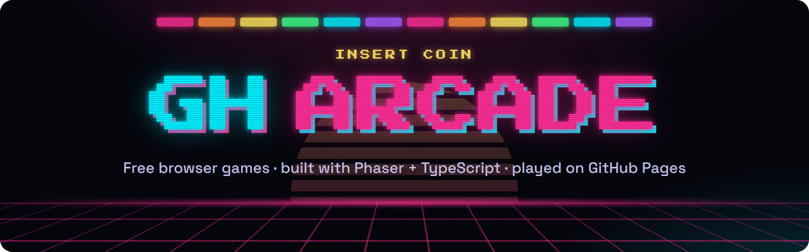
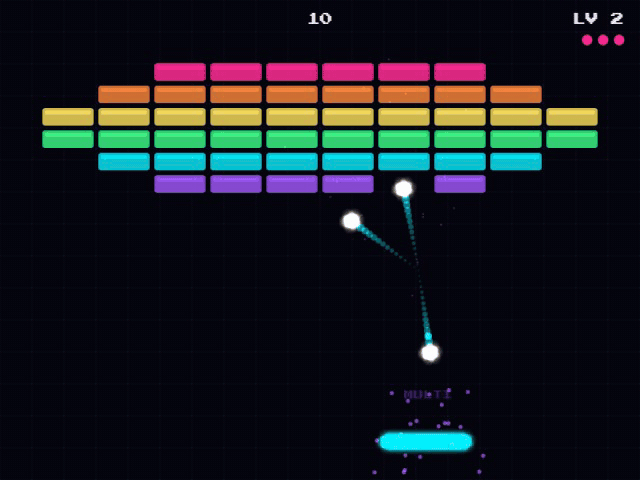
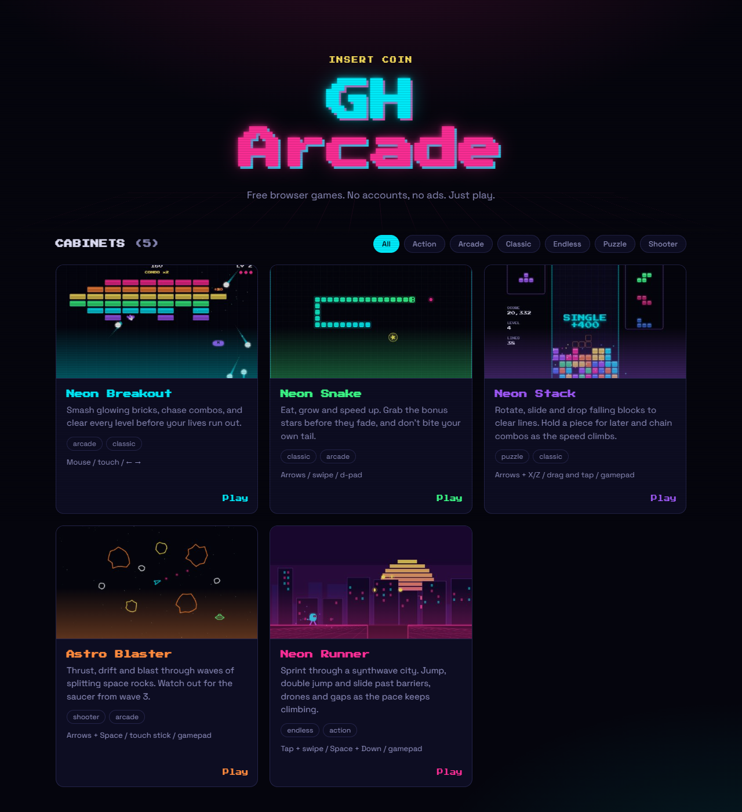

<div align="center">

<a href="https://tmhsdigital.github.io/GH-Arcade/">
  
</a>

<br />
<br />

[](https://tmhsdigital.github.io/GH-Arcade/)

[](https://github.com/TMHSDigital/GH-Arcade/actions/workflows/deploy.yml)
[](#games)
[](https://phaser.io)
[](https://www.typescriptlang.org)
[](https://vite.dev)
[](https://github.com/TMHSDigital/GH-Arcade/commits/main)
[](LICENSE)

**A growing collection of free, open-source arcade games that run in your browser.**<br />
No installs. No accounts. No ads. Works on desktop and mobile.

[Games](#games) ·
[Features](#features) ·
[Quick start](#quick-start) ·
[Make a game](#make-your-own-game) ·
[How it works](#how-it-works) ·
[Roadmap](#roadmap)

</div>

<br />

<a id="games"></a>

## Games

### Neon Breakout

<p align="center">
  <a href="https://tmhsdigital.github.io/GH-Arcade/games/breakout/">
    
  </a>
  <br />
  <sub>Multi-ball on level 2. Click the clip to play.</sub>
</p>

The classic brick-breaker, rebuilt with a synthwave glow. Aim with the paddle, chain combos between bounces, and catch power-ups as they fall.

- **5 hand-built levels** that loop with a faster ball each time around
- **Armored bricks** that take 2 or 3 hits
- **Combo multiplier** up to ×8
- **4 power-ups:** wide paddle, multi-ball, slow-mo and extra life
- **Juice:** particles, screen shake and synthesized retro sound

**[Play Neon Breakout](https://tmhsdigital.github.io/GH-Arcade/games/breakout/)**

<details>
<summary><b>Controls, power-ups and scoring</b></summary>

<br />

| Action | Keyboard | Mouse | Touch |
| --- | --- | --- | --- |
| Move paddle | <kbd>←</kbd> <kbd>→</kbd> or <kbd>A</kbd> <kbd>D</kbd> | Move | Drag |
| Launch ball | <kbd>Space</kbd> or <kbd>↑</kbd> | Click | Tap |
| Pause | <kbd>P</kbd> or <kbd>Esc</kbd> | | |
| Mute | <kbd>M</kbd> | | |

| Power-up | Pill | Effect |
| --- | --- | --- |
| Wide | Green **W** | Paddle grows 50% for 12 seconds |
| Multi-ball | Purple **M** | Splits into 3 balls |
| Slow-mo | Yellow **S** | Ball slows to 70% for 8 seconds |
| Extra life | Pink **+** | One more life (rare) |

**Scoring:** each brick is worth `10 × its hit points × combo`. The combo counts bricks broken since the ball last touched the paddle, capped at ×8. Clearing a level adds `250 × level number`. The game pauses by itself when you switch tabs.

</details>

<a id="features"></a>

## Features

<p align="center">
  
  <br />
  <sub>The hub. Every game gets a cabinet card, and your best score shows on it once you've played.</sub>
</p>

| Feature | Details |
| --- | --- |
| **Plays anywhere** | A pure static site on GitHub Pages. Loads straight in the browser on desktop, tablet or phone. |
| **Touch-ready** | Games scale to fit any screen and support mouse, keyboard and touch. |
| **High scores** | Best scores are saved on your device and shown on the hub. No sign-up. |
| **Zero-asset audio** | Sound effects are synthesized live with the Web Audio API, so there are no audio files to download. |
| **Fast loads** | Each game is its own page and bundle. Phaser is split into one shared file that your browser caches across games. |
| **One command per game** | `npm run new-game` scaffolds a working game and adds it to the hub. No config to edit. |

<a id="quick-start"></a>

## Quick start

Requires **Node 20+**.

```bash
git clone https://github.com/TMHSDigital/GH-Arcade.git
cd GH-Arcade
npm install
npm run dev
```

Then open **http://localhost:5173/GH-Arcade/**.

| Script | What it does |
| --- | --- |
| `npm run dev` | Dev server with hot reload |
| `npm run build` | Type-check, then production build into `dist/` |
| `npm run preview` | Serve the production build locally |
| `npm run typecheck` | TypeScript check only |
| `npm run new-game <slug> ["Title"]` | Scaffold a new game |

> [!TIP]
> In dev mode the running Phaser game is exposed as `window.game`, so you can inspect scenes from the browser console, for example `game.scene.getScene('Game')`. This is removed from production builds.

<a id="make-your-own-game"></a>

## Make your own game

Adding a game takes three steps, and no config files.

### 1. Scaffold it

```bash
npm run new-game space-dodge "Space Dodge"
```

This copies `games/_template/` to `games/space-dodge/`. The template is a small, playable Phaser game with movement, collectibles and high scores already wired up. The command also adds a card for it to the hub.

### 2. Describe it

Edit the new entry in [`games/registry.json`](games/registry.json). This is what the hub card shows.

```jsonc
{
  "slug": "space-dodge",            // folder name and URL: /games/space-dodge/
  "title": "Space Dodge",           // card title
  "description": "Weave through…",  // card blurb
  "tags": ["arcade", "shooter"],    // hub filter chips (they appear once 2+ tags exist)
  "accent": "#a45bff",              // card glow color
  "controls": "Arrows / touch"      // controls hint on the card
}
```

### 3. Build it

Run `npm run dev`, open `/GH-Arcade/games/space-dodge/` and start editing `main.ts`. Vite picks up every `games/*/index.html` automatically. Push to `main` and it's live.

### The shared toolkit

Games can import ready-made helpers from [`shared/`](shared):

```ts
import { createArcadeGame } from '../../shared/phaser-config';
import { submitHighScore } from '../../shared/storage';
import { tone } from '../../shared/sfx';

createArcadeGame({ scenes: [MenuScene, GameScene] });  // fit-to-screen Phaser game

tone({ freq: 660, toFreq: 990, duration: 0.1 });       // rising "coin" blip
const isNewRecord = submitHighScore('space-dodge', score);
```

- **[`phaser-config.ts`](shared/phaser-config.ts)**: `createArcadeGame()` gives you a standard Phaser setup with fit-to-screen scaling, Arcade physics and multi-touch.
- **[`storage.ts`](shared/storage.ts)**: `getHighScore()`, `submitHighScore()`, `loadJSON()` and `saveJSON()` wrap `localStorage` so it never throws, even in private browsing.
- **[`sfx.ts`](shared/sfx.ts)**: `tone()`, `noise()` and `setMuted()` play retro sound effects synthesized with Web Audio.
- **[`game-shell.css`](shared/game-shell.css)**: styles the full-screen canvas page and the "← Arcade" back button.

> [!NOTE]
> Phaser is the default engine, but it's optional. A game is just an `index.html` with a script, so plain Canvas, Three.js or anything else Vite can bundle will work.

<a id="how-it-works"></a>

## How it works

Every push to `main` publishes the site automatically:

1. **Push** to `main` triggers the [deploy workflow](.github/workflows/deploy.yml).
2. **GitHub Actions** installs dependencies with `npm ci`, then runs `npm run build`.
3. **The build** type-checks the code with TypeScript, then Vite bundles the hub plus every `games/*/index.html` into `dist/`.
4. **GitHub Pages** serves `dist/` at [tmhsdigital.github.io/GH-Arcade](https://tmhsdigital.github.io/GH-Arcade/).

<details>
<summary><b>Project layout</b></summary>

```
GH-Arcade/
├── index.html              # Arcade hub page
├── src/hub/                # Hub script and styles (renders cards from the registry)
├── games/
│   ├── registry.json       # The list of games shown on the hub
│   ├── _template/          # Starter game copied by `npm run new-game`
│   └── breakout/           # Neon Breakout
│       ├── index.html
│       ├── main.ts         # Boots Phaser with the game's scenes
│       ├── config.ts       # Tuning constants and level layouts
│       └── scenes/         # Boot → Menu → Game → GameOver
├── shared/                 # Toolkit shared by all games
├── public/                 # Static files copied as-is (favicon)
├── scripts/new-game.mjs    # Game scaffolder
├── vite.config.ts          # Multi-page build with game auto-discovery
└── .github/workflows/      # Build and deploy to GitHub Pages
```

</details>

<details>
<summary><b>Design decisions</b></summary>

<br />

- **Vite multi-page build, not a single-page app.** Each game is an independent page, so one game can't break another, and each one loads only its own code.
- **Shared Phaser chunk.** Phaser is about 340 KB gzipped. It's split into its own file so it downloads once and is cached for every game.
- **Procedural art and audio.** Neon Breakout draws its textures at runtime and synthesizes its sounds, so the whole game is about 6 KB gzipped on top of Phaser.
- **Relative links between pages.** The hub and games link to each other with relative paths, so the site works on the dev server, in preview and on Pages.

</details>

<a id="roadmap"></a>

## Roadmap

**Shipped**

- [x] Arcade hub with tag filters and saved high scores
- [x] Neon Breakout
- [x] One-command game scaffolding
- [x] Automatic GitHub Pages deploys

**Up next**

- [ ] Snake
- [ ] Asteroids-style shooter
- [ ] Falling-block puzzler
- [ ] Endless runner
- [ ] Gamepad support
- [ ] Installable PWA with offline play

Have an idea? [Open an issue](https://github.com/TMHSDigital/GH-Arcade/issues/new).

## Contributing

New games, level designs and bug fixes are welcome.

1. Fork the repo and create a branch.
2. Run `npm run new-game <slug>` and build your game.
3. Check that `npm run build` passes.
4. Open a pull request with a screenshot or GIF of your game.

By contributing, you agree that your work is released under the project's MIT License.

## License

[MIT](LICENSE) © 2026 TM Hospitality Strategies. You're free to use, modify and share the code, including commercially, as long as you keep the copyright notice.

<br />

<div align="center">

**[Insert coin at tmhsdigital.github.io/GH-Arcade](https://tmhsdigital.github.io/GH-Arcade/)**

<sub>Built with <a href="https://phaser.io">Phaser</a>, <a href="https://www.typescriptlang.org">TypeScript</a> and <a href="https://vite.dev">Vite</a> · Hosted on <a href="https://pages.github.com">GitHub Pages</a></sub>

</div>
